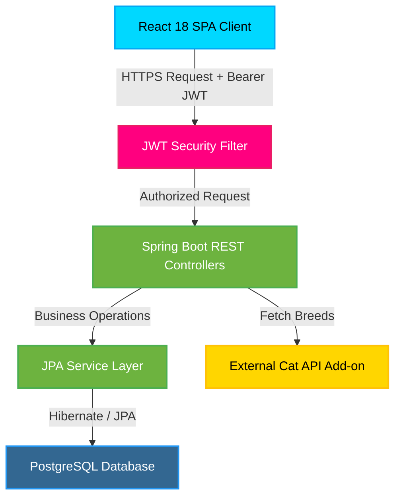

# PetClinic SaaS Platform - Public Portfolio & Interactive Simulator

> [!IMPORTANT]
> **Academic Integrity Notice:** The core source code of this project belongs to an academic course (*Proceso Software y Gestión II* at *University of Sevilla, ETSII*). To prevent plagiarism and comply with university regulations, the repository remains private. This public repository serves as a **professional portfolio and interactive live simulator** to demonstrate the project's features, architecture, and engineering standards.

## 🔗 Live Showcase & Interactive Simulator
🚀 **[Click here to open the Live Interactive Showcase Web App](https://SantiiDG.github.io/petclinic-showcase/)**

---

## 📋 Overview

**PetClinic SaaS** is a comprehensive software-as-a-service platform designed to digitalize and centralize veterinary clinic operations. The project modernizes the classic Spring Petclinic application, upgrading it to a modern Single Page Application (SPA) architecture, securing it with JSON Web Tokens (JWT), and implementing detailed IT Service Management (ITSM) SLA workflows.

This showcase details the full lifecycle of the project, including its software architecture, database design, DevOps practices, and agile management metrics.

---

## 👤 Santiago Diestro Gallego - Core Contributions

In this team project, I acted as a **Fullstack Developer & SLA/ITSM Analyst**, contributing directly to the following areas:

*   **Frontend UI/UX (React 18):** Designed and styled interactive, responsive views for Pet Owners, Clinic Owners, and Veterinarians. Built forms and tables for pet registration and booking lists.
*   **Customer Agreement Modeling:** Drafted commercial terms, Service Level Agreements (SLA), support matrices, ITSM policies, and service credit formulas.
*   **SLA & iTop Monitoring:** Handled incident and service request monitoring. Documented ticket lifecycles (TTO/TTR targets) in ZenHub and iTop to track service compliance.
*   **APIs & Core Integrations:** Configured third-party service integration (e.g. *The Cat API* as an external breed search service add-on) and pricing plans via the *SPACE* framework.

---

## 🛠️ Technology Stack

| Component | Technology | Role |
| :--- | :--- | :--- |
| **Frontend** | React 18, React Router, HTML5, Custom CSS | SPA Client Interface |
| **Backend** | Spring Boot 3, Java 17, REST APIs, Maven | Secure Business Logic |
| **Security** | Spring Security, JSON Web Tokens (JWT) | Role-Based Access Control |
| **Database** | PostgreSQL, JPA/Hibernate, H2 (Testing) | Relational Storage & Persistence |
| **DevOps & QA** | Docker, SonarQube, GitHub Actions | Continuous Quality & Deployment |
| **Agile & ITSM** | ZenHub (Scrum), iTop, Clockify | Project Tracking & Service Management |

---

## 📐 System Architecture

---

## ⚙️ DevOps, Quality & ITSM Practices

*   **Agile Methodology (Scrum):** Development structured in 4 Sprints, utilizing ZenHub for sprint planning, Kanban tracking, and burndown chart metrics.
*   **GitFlow Workflow:** Followed strict branch guidelines: `main` (stable production releases), `develop` (integration), and `feature/*` / `bugfix/*` (individual tasks) to avoid code conflicts.
*   **Continuous Quality (SonarQube):** Clean code certified with **0 Bugs, 0 Vulnerabilities, 0 Code Smells**, and a **95.8% test coverage** on the core backend.
*   **ITSM SLA Framework:** Real SLAs monitored via iTop for Incident Management & Request Fulfillment, tracking Time To Own (TTO) and Time To Resolve (TTR) compliance to calculate service credit compensations for active plans (Basic, Gold, Platinum).

---

## 📁 Repository Contents

*   `index.html` - Interactive landing page and browser simulator.
*   `style.css` - Custom premium styling sheet for glassmorphism layout and animations.
*   `app.js` - Client-side state manager and simulator logic.
*   `README.md` - Professional portfolio introduction.

---

## 📧 Contact Information

For any inquiries regarding this project or potential employment opportunities, please feel free to reach out:

*   **Developer:** Santiago Diestro Gallego
*   **Email:** [santi18diestro@gmail.com](mailto:santi18diestro@gmail.com)
*   **GitHub Portfolio:** [SantiiDG](https://github.com/SantiiDG)
